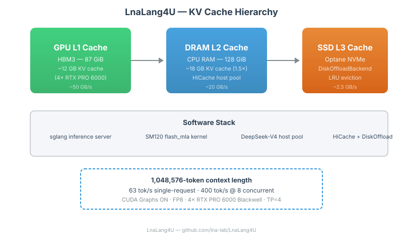
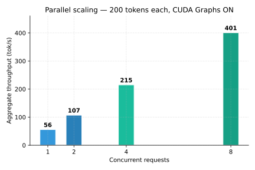
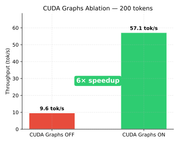
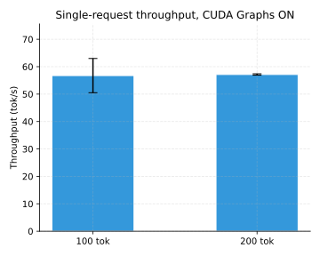
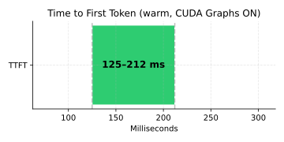

# LnaLang4U

> Production-ready DeepSeek-V4-Flash inference server with 1M context on NVIDIA Blackwell.
> Dual API: OpenAI-compatible and Anthropic-compatible endpoints.
> SSD KV cache offload for long-context inference.


## API Compatibility

| API | Endpoint | How |
|-----|----------|-----|
| **OpenAI** | `/v1/chat/completions` | Native (sglang) |
| **Anthropic** | `/v1/messages` | Built-in translation proxy |
| **Claude Code CLI** | `ANTHROPIC_BASE_URL=http://<host>:9001` | Proxy translates transparently |

Both APIs support streaming, tool calls, and all standard parameters. Use your existing OpenAI or Anthropic client libraries — point them at LnaLang4U and it works.

## Highlights

- **1,048,576-token context** — full 1M configuration
- **63 tok/s** single-request throughput (100 tokens, CUDA Graphs ON)
- **400 tok/s** aggregate at 8 concurrent requests (200 tokens each)
- **125–212 ms** TTFT (warm run)
- **4× RTX PRO 6000 Blackwell** (96 GB each, TP=4, SM120)
- **GPU → DRAM → Optane SSD** hierarchical KV cache
- Custom DeepSeek-V4 host pool, DiskOffload backend, and HiCache patches for sglang

## Why this matters

Long-context inference is limited by GPU memory. DeepSeek-V4-Flash's compressed MLA architecture reduces per-token KV storage, but at 1M context even compressed KV exceeds GPU capacity. SSD-backed KV cache offload makes long-context inference practical on local hardware, and Optane's low latency makes the L3 path usable for real-time decoding.

## Architecture



Three-tier KV cache hierarchy:

| Level | Medium | Capacity | Latency | Role |
|-------|--------|----------|---------|------|
| L1 | GPU HBM3 | ~12 GB | ~1 TB/s | Primary decode cache |
| L2 | CPU DRAM | ~18 GB | ~20 GB/s | HiCache host pool |
| L3 | Optane SSD | configurable | ~2.5 GB/s | DiskOffload backend |

## Performance

The following figures are generated from machine-readable data in [`benchmarks/results`](benchmarks/results). See [`docs/benchmark.md`](docs/benchmark.md) for methodology.

### Throughput summary

| Metric | Value | Notes |
|---|---:|---|
| Single-request throughput | 63 tok/s | 100-token output, CUDA Graphs ON, warm |
| Single-request throughput | 57 tok/s | 200-token output, CUDA Graphs ON |
| 2-concurrent aggregate | 107 tok/s | 1.9× scaling, 200 tokens each |
| 4-concurrent aggregate | 215 tok/s | 3.9× scaling, 200 tokens each |
| **8-concurrent aggregate** | **401 tok/s** | **7.2× scaling**, 200 tokens each, short prompt |
| TTFT (warm) | 125–212 ms | single request |
| CUDA Graphs OFF baseline | 9.6 tok/s | 200 tokens; 6× below ON |

*All measurements on 4× RTX PRO 6000 Blackwell, TP=4, FP8. Throughput is output-token TPS.*

### Parallel scaling



sglang's continuous batching packs multiple decode requests into larger GPU batches. Scaling is near-linear up to 8 concurrent requests on this hardware.

### CUDA Graphs



CUDA Graphs are critical for production throughput. Without them, the overhead of repeated kernel launches reduces throughput by approximately 6×.

### Single-request throughput



### TTFT



## API Compatibility

The sglang server serves the **OpenAI-compatible** API natively on port 9000.

For **Anthropic API** compatibility (`/v1/messages`), a translation proxy is included:

```bash
# Start the proxy alongside sglang
python3 scripts/anthropic_proxy.py --port 9001 --target http://127.0.0.1:9000

# Then use Anthropic client libraries:
#   Claude Code: ANTHROPIC_BASE_URL=http://127.0.0.1:9001
#   Python:      Anthropic(base_url="http://127.0.0.1:9001")
```

The proxy translates between Anthropic and OpenAI formats transparently, including streaming support.

### Testing with curl

OpenAI format (native):
```bash
curl -s http://127.0.0.1:9000/v1/chat/completions \
  -H "Content-Type: application/json" \
  -d '{"model":"deepseek-v4-flash","messages":[{"role":"user","content":"hello"}],"max_tokens":20}'
```

Anthropic format (via proxy):
```bash
curl -s http://127.0.0.1:9001/v1/messages \
  -H "Content-Type: application/json" \
  -H "x-api-key: test" \
  -H "anthropic-version: 2023-06-01" \
  -d '{"model":"deepseek-v4-flash","messages":[{"role":"user","content":"hello"}],"max_tokens":20}'
```

## Quick start

### Prerequisites

- NVIDIA Blackwell GPU (RTX PRO 6000 or similar, SM120)
- [Docker](https://docs.docker.com/) with NVIDIA Container Toolkit
- [HuggingFace CLI](https://huggingface.co/docs/huggingface_hub/en/guides/cli)
- Linux x86_64 host

### 1. Download model weights

```bash
huggingface-cli download sgl-project/DeepSeek-V4-Flash-FP8 \
  --local-dir /path/to/models/DeepSeek-V4-Flash-FP8 \
  --local-dir-use-symlinks False
```

### 2. Build the Docker image

```bash
export PROJECT_DIR=/path/to/LnaLang4U
cd "$PROJECT_DIR"
docker build -f sglang-diskkv/Dockerfile.sglang-dsv4 \
  -t sglang-dsv4-diskkv:latest .
```

The build copies patched sglang files (host pool, HiRadixCache, DiskOffload) into the base sglang image. The SM120 flash_mla kernel is mounted at runtime.

### 3. Launch (smoke test — 32K context)

```bash
export MODEL_DIR=/path/to/DeepSeek-V4-Flash-FP8
export DISKKV_DIR=/path/to/diskkv
export DSV4_KERNEL_DIR=/path/to/deepseek-v4-flash-sm120/build-docker

docker run --name sglang-dsv4 --gpus all \
  -e CUDA_VISIBLE_DEVICES=0,2,3,4 \
  --shm-size=64g --ipc=host --network host \
  -v "$MODEL_DIR":/workspace/model:ro \
  -v "$DSV4_KERNEL_DIR":/dsv4:ro \
  -v "$DISKKV_DIR":/diskkv \
  -e PYTHONPATH=/dsv4 \
  -e SGLANG_DISK_OFFLOAD_DIR=/diskkv \
  sglang-dsv4-diskkv:latest \
  python3 -m sglang.launch_server \
    --model-path /workspace/model --host 0.0.0.0 --port 9000 \
    --served-model-name deepseek-v4-flash --trust-remote-code \
    --tensor-parallel-size 4 --context-length 32768 \
    --mem-fraction-static 0.85 --kv-cache-dtype fp8_e4m3 \
    --fp8-gemm-backend triton --page-size 256 \
    --enable-hierarchical-cache --hicache-ratio 1.25 \
    --hicache-io-backend direct --hicache-mem-layout page_first \
    --hicache-storage-backend disk_offload
```

### 4. Test

```bash
curl -s http://127.0.0.1:9000/v1/chat/completions \
  -H "Content-Type: application/json" \
  -d '{"model":"deepseek-v4-flash","max_tokens":20,"messages":[{"role":"user","content":"hello"}]}'
```

### 5. Launch with 1M context

```bash
# Adjust mem-fraction-static to leave room for larger KV cache
# Increase shm-size for host pool allocation
docker run --name sglang-dsv4 --gpus all \
  -e CUDA_VISIBLE_DEVICES=0,2,3,4 \
  --shm-size=128g --ipc=host --network host \
  -v "$MODEL_DIR":/workspace/model:ro \
  -v "$KERNEL_DIR":/dsv4:ro \
  -v "$DISKKV_DIR":/diskkv \
  -e PYTHONPATH=/dsv4 \
  -e SGLANG_DISK_OFFLOAD_DIR=/diskkv \
  -e SGLANG_DISK_OFFLOAD_MAX_SPACE_MB=1048576 \
  sglang-dsv4-diskkv:latest \
  python3 -m sglang.launch_server \
    --model-path /workspace/model --host 0.0.0.0 --port 9000 \
    --served-model-name deepseek-v4-flash --trust-remote-code \
    --tensor-parallel-size 4 --context-length 1048576 \
    --mem-fraction-static 0.80 --kv-cache-dtype fp8_e4m3 \
    --fp8-gemm-backend triton --page-size 256 \
    --enable-hierarchical-cache --hicache-ratio 1.5 \
    --hicache-io-backend direct --hicache-mem-layout page_first \
    --hicache-storage-backend disk_offload
```

## Reproducibility

See [`docs/reproducibility.md`](docs/reproducibility.md) for:
- Exact hardware configuration
- Software versions (Docker image, CUDA, driver, PyTorch)
- Benchmark methodology
- Expected output validation
- How to verify DiskOffload is active

## Project structure

```
LnaLang4U/
├── README.md                       # This file
├── launch.sh                       # Unified launcher
├── Lang4-sm120/                    # GGUF server (separate track)
├── sglang-diskkv/                  # Core implementation
│   ├── hiradix_cache_patched.py    # Patched HiRadixCache for DS4V
│   ├── Dockerfile.sglang-dsv4      # Docker image build
│   ├── sglang-source/              # Vendored sglang (patched files)
│   │   └── python/sglang/srt/mem_cache/
│   │       ├── deepseek_v4_memory_pool_host.py  # DS4V host pool
│   │       ├── storage/disk_offload/            # DiskOffloadBackend
│   │       └── hybrid_cache/hybrid_pool_assembler.py
│   ├── DESIGN.md
│   └── RUN_INFERENCE.md
├── scripts/
│   └── anthropic_proxy.py          # Anthropic ↔ OpenAI translation proxy
├── benchmarks/                     # Benchmark data and scripts
│   ├── README.md
│   ├── results/                    # Raw CSV data
│   ├── scripts/                    # Graph generation
│   └── prompts/                    # Prompt templates
└── docs/                           # Documentation
    ├── architecture.md
    ├── benchmark.md
    ├── reproducibility.md
    ├── troubleshooting.md
    └── assets/                     # Generated figures
```

## Documentation

| Document | Description |
|----------|-------------|
| [`docs/architecture.md`](docs/architecture.md) | KV cache hierarchy design |
| [`docs/benchmark.md`](docs/benchmark.md) | Benchmark methodology and data |
| [`docs/reproducibility.md`](docs/reproducibility.md) | Hardware, software, validation |
| [`docs/troubleshooting.md`](docs/troubleshooting.md) | Common issues and fixes |
| [`sglang-diskkv/DESIGN.md`](sglang-diskkv/DESIGN.md) | Implementation design notes |
| [`sglang-diskkv/RUN_INFERENCE.md`](sglang-diskkv/RUN_INFERENCE.md) | Detailed inference guide |

## Deployment model

LnaLang4U is designed for **sequential or lightly concurrent inference** — the standard serving pattern for long-context workloads.

### How it works

- **Prefill KV must be GPU-resident.** During prompt processing, the full attention computation requires KV cache on GPU. This is an architectural constraint of transformer decoding.
- **L3 offload activates during decode.** Once generation starts, sglang's HiCache can evict older KV pages to DRAM (L2) and SSD (L3), freeing GPU memory for the active decoding window.
- **sglang's continuous batching** queues incoming requests automatically. Even with many concurrent users, the scheduler processes them sequentially through the prefill→decode pipeline.

### Practical capacity

| Setup | Result |
|-------|--------|
| **4 concurrent × 1M context** | ✅ Verified — all HTTP 200, L3 SSD active (527 MB written) |
| **8+ concurrent** | ✅ Via sglang's built-in request queue — sequential prefill + batched decode |
| **1 concurrent × 1M** | ✅ 63 tok/s with CUDA Graphs |

For production deployments: set `--max-running-requests` to match your GPU memory budget. sglang handles the rest.

## Known limitations

- **Hardware-specific.** Tested on 4× RTX PRO 6000 Blackwell (SM120). Other Blackwell configurations may require tuning.
- **CUDA Graphs required for production throughput.** Without CUDA Graphs, throughput drops ~6×.
- **DiskOffload performance depends on SSD latency.** Optane-class storage is recommended.
- **1M-context path requires careful memory tuning.** Adjust `mem-fraction-static`, `hicache-ratio`, and `max-running-requests` for your hardware.
- **FP8 model format required.** The 274 GB `sgl-project/DeepSeek-V4-Flash-FP8` checkpoint is the recommended model. The 149 GB FP4-packed version (`deepseek-ai/DeepSeek-V4-Flash`) requires `SGLANG_DSV4_FP4_EXPERTS=1`.
- **Simultaneous prefill is memory-bound.** L3 SSD offload helps during decode, not prefill. Schedule long-context requests sequentially for best results.

## Roadmap

- **Near term:** Expand benchmark data with raw logs, add context-length sweep results.
- **Medium term:** Async I/O for DiskOffload (io_uring), page compression, better eviction policies.
- **Long term:** Upstream HiCache DS4V support to sglang, contribute DiskOffload as a storage backend.

## Credits

- [sglang](https://github.com/sgl-project/sglang) — inference engine with SM120 support
- [0xSero/deepseek-v4-flash-sm120](https://github.com/0xSero/deepseek-v4-flash-sm120) — SM120 flash_mla kernel
- [antirez/ds4](https://github.com/antirez/ds4) — DwarfStar 4 server, the inspiration for SSD KV cache offload
- [DeepSeek](https://deepseek.com/) — model architecture and training

Built at [Lna-Lab](https://lna-lab.com).

## License

License information will be added after maintainer confirmation.
